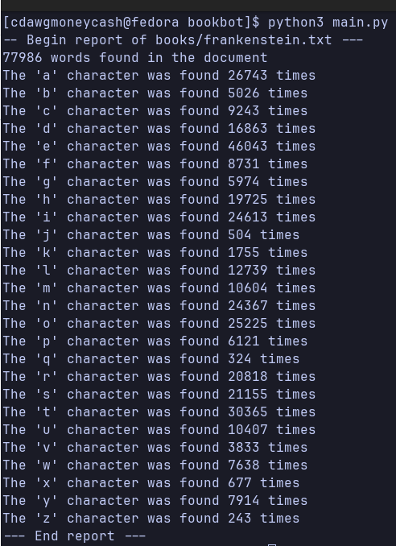

BookBot lets you get the number of words from a text. Also provides you with how many times a letter in the alphabet appears in the text.

To get it too work you need to provide a correct file path for the text in main.py and then python3 main.py

